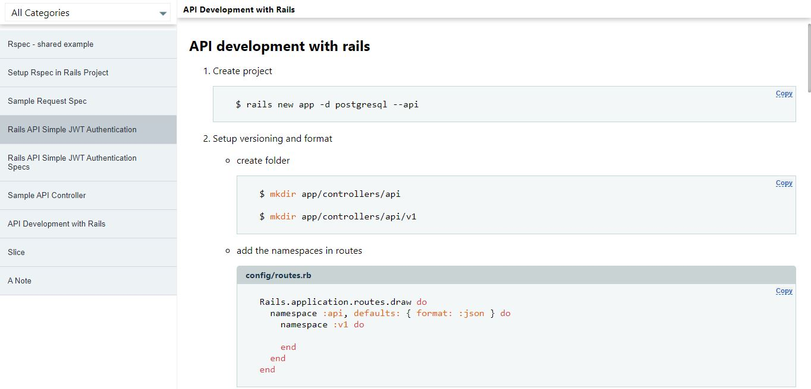

# Short Notes

> A react single-page application to view notes. It is a three part app, with a Ruby on Rails app serving as an api for both the panel and public facing apps. The notes are created, updated and destroyed in the panel, while the public facing app is only used to view the notes.



## Built With

- React

## Live Demo

[demo](https://shutnotes.netlify.app/)

## Getting Started

To get a local copy up and running follow these steps on the command line.

```bash

  # Clone the project from it's github repo.

  $ git clone https://github.com/chasscepts/shortnotes

  # Change directory to the root of project

  $ cd shortnotes

  # Install all dependencies

  $ npm install

  # Open app in your local browser

  $ npm run start

  # To run the tests

  $ npm run test

  # To build the project for production

  $ npm run build

```

## Authors

👤 **Obetta Francis**

[](https://github.com/chasscepts) [](https://twitter.com/chasscepts) [](https://www.linkedin.com/in/chasscepts/)

## 🤝 Contributing

Contributions, issues, and feature requests are welcome!

Feel free to check the [issues page](https://github.com/chasscepts/shortnotes/issues).

## Show your support

Give a ⭐️ if you like this project!

## Acknowledgments
- Microverse Community
- Everyone whose code was used in this project

## 📝 License

This project is [MIT](./LICENSE)